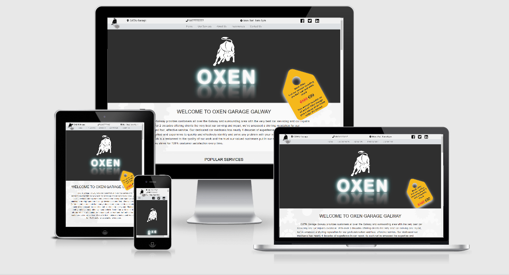

# Project: OXEN Car Service
[View this website on GitHub Pages]( https://kpokc.github.io/MS1-Car-Services-Galway/index.html)

<h1 align="Center"></h1>

---

The primary goal of the website is to represent OXEN Car Service garage on the web and to attract new customers through Google search. And to interact with existing and potential customers.

The website will tell short story about the garage. Provides information about most popular services and special offers as well as describes full range of services. On the website customers can find short information about garage team and read reviews. Also find contact details (address, phone number, location) and opening hours.

## UX
---
### 1. Target client:
#### Our potential client:
-	The website will focus on a car owner looking for car repairs or maintenance.
-	Current clients who buying garage services

#### Our demographic:
-	Car owners – private or/and commercial.
-	Car owners age between 25 – 65 years
-	Living in Galway city and surrounding areas.

### 2. Our client is looking to achieve:
-	Our client is looking for a car repair garage in local area. Garage that can offer full range car repair services on all kind of cars. Client expects great value for money and that he can trust to garage team.

### 3. How this website will help clients
-	On the website client can quickly find all popular services garage provides as well as short brief of main services.
-	The website has quick story about the business, also customer can find pictures of owner and employees as well as their short “about” stories - this will help to build trust.
-	On the website customer can find testimonials, links to social media accounts - customer can check reviews and stay connected. To receive news, offers, new available services.   
### User stories:
-	As a customer, I want to know what kind of services garage provides, to be sure if you have the one, I’m looking for?
-	As a user, I want to know people’s opinion about the garage, to understand if I can trust?
-	As a user, I want to know location of the garage, to find out if the garage is close enough to me?
-	As a customer, I want to know opening hours, to schedule my time.
### 4. Wireframe
-	Below are the desktop, tablet and mobile wireframes. These are wireframes of landing page of five sections created with the Balsamiq Wireframes application. 

[Link to my Balsamiq Wireframes]( https://github.com/Kpokc/MS1-Car-Services-Galway/blob/master/assets/wireframes/car_service_project.pdf)

## Features
---
### Initial Existing Features
-	**Responsive** - A fully responsive landing page will rescale itself to preserve the user experience.

-	**Navigation** - Fixed navigation allows the user to easily navigate. Allows the user quick accessibility to social media links, location and, phone, opening hours.

-	**Animation** - CSS animation to represent garage name and logo to user.

-	**Promo label** - promotes special week offer to users.

-	**Welcome section** - User can read a brief story about the business.  

-	**Our Services** - User can find popular and main services garage can offer.

-	**About Us** - User can see employee’s pictures and find what kind of knowledge they have. have.  

-	**Testimonials** - User can read garage customers reviews.

-	**Contact Us** - User can contact garage if his looking for some specific service or feature. Opening hours, address, location represented as well.

-	**Footer** - User can access menu.

### Features Left to Implement 
-	Implement "Contact form" submission function.

## Technologies Used
---
### Languages

- [HTML5](https://en.wikipedia.org/wiki/HTML5)
- [CSS3](https://en.wikipedia.org/wiki/Cascading_Style_Sheets)
- [JavaScript](https://www.javascript.com/)

### Frameworks, Libraries & Programs

- [Bootstrap](https://getbootstrap.com/) - The project uses Bootstrap facilitate a responsive mobile-first design and user experience.
- [HTML Agility Pack](https://html-agility-pack.net/download) / / [Agility DOCS](https://html-agility-pack.net/documentation) - HAP is an HTML parser written in C# to read/write DOM and supports plain XPATH or XSLT.
- [Balsamiq Wireframes](https://balsamiq.com/) - To create wireframes.
- [GitHub]( https://github.com/Kpokc) - Used to store the project's code.
- [Git](https://git-scm.com/) / [GitPod](https://gitpod.io/workspaces/) - Used for version control.
- [Google Fonts](https://fonts.google.com/) - To style the website fonts.
- [Google Chrome DevTools](https://developers.google.com/web/tools/chrome-devtools) - Helps you edit pages on-the-fly and diagnose problems quickly.
- [Autoprefixer](https://autoprefixer.github.io/) - Parses CSS and adds vendor prefixes.
- [Dillinger](https://dillinger.io/) - Online README editor
- [Am I Responsive](http://ami.responsivedesign.is/#) - Screen shots of the various device breakpoints for responsive design.

## Testing
---
- [W3C](https://validator.w3.org/#validate_by_input) - HTML Validator
- [W3C](https://validator.w3.org/#validate_by_input) - CSS Validator
- [Closing Tag Checker](https://www.aliciaramirez.com/closing-tags-checker/) - Closing Tag Checker for HTML5
- [Google Mobile-Friendly Test](https://search.google.com/test/mobile-friendly) - Mobile-friendly check. 
- [Google Lighthouse](https://web.dev/measure/?gclid=Cj0KCQiAmL-ABhDFARIsAKywVafiGIsP9vTw5JFvUE3160xtJvA3OEmyO3pu4xbHtuFtBgXB3Ws2sA4aAiVoEALw_wcB) - To see how well your website performs [OXEN Performance](https://github.com/Kpokc/MS1-Car-Services-Galway/blob/master/assets/img/lighthouse/performance.png). 
- [Online-Spellcheck](https://www.online-spellcheck.com/) Online spelling and grammar checks.

1. Code & Responsivnes.
    -   Website was test and working well in browsers (Chrome, Safari, FireFox, Opera, IE).
    -   Responsivnes was tested on a variety of devices (Desctops, laptops and mobile phones). 
    -   Website tested with Google Mobile-Friendly Test - website is mobile friendly.
    -   CSS code ran through Autoprefixer and copied.
    -   HTML Validator - code OK.
    -   CSS Validator - code OK.
    -   Closing Tag Checker - code OK.

2.  Links.
    -   I tested logo (top left) to ensure it reloads the webpage.
    -   "OXEN Garage" location link (top left beside Logo) opens new tab in the browser with google map location. 
    -   Tested each navigation link to ensure it is working correctly and navigates to correct web page section.
    -   Social Media links (right top and in Contact Us section) were tested, each link open a new tab in the browser with correct page.
    -   Footer navigation links - working correctly and navigates to correct web page section.
    -   Copyright lynx (footer) - each link open a new tab in the browser with correct page.

3. Contact Form. ("Contact form" submission function not implemented)
    -   Try to submit the empty form - popup error message regarding required fields.
    -   Try to submit the form with an invalid email - popup error message that email address is incoplete.
    -   Try to submit the form with all valid inputs - website reloads.

4.  Performance.
    -   Google Lighthouse - The Website [Performance](https://github.com/Kpokc/MS1-Car-Services-Galway/blob/master/assets/img/lighthouse/performance.png)

## Deployment
---
Project has been deployed on GitHub Pages:
1. Code was written using Gitpod.
2. During development code was committed and pushed to GitHub [repository](https://github.com/Kpokc/MS1-Car-Services-Galway).
3. In the current repository click on "Settings".
4. Scroll down to "GitHub Pages" section
5. Select "Master" from dropdown menu and click Save.
6. This will publishes the project to GitHub Pages and displays the link.

To run my code locally - in repository simply click "CODE" button and select an option "Clone" or "Download".
Clone - provides a URL, which you can use in your IDE.
Download - provides a link to ZIP file which can be unzipped on your local machine.

## Credits
---
### Content

- The text for **Offer** was copied from [GROUPON](https://www.groupon.ie/deals/car-service-ireland)
- The text for **Welcome Section** was copied from [Ward's Garage](https://www.wardsgarage.ie/)
- The text for **About Us Section** was partially copied from [Hectors Auto Repair](https://www.hectorsautorepairla.com/)
- The text for **Testimonials** was copied from [Leveso](https://leveso.de/testimonial-view/)

### Media
- [Fontawesome](https://fontawesome.com/) - Used for the icons.
- [Pixabay](https://pixabay.com/) - Stunning free images (team and Customers picktures).
- [Flaticon](https://www.flaticon.com/) - Database of free icons.
- [Vecteezy](https://www.vecteezy.com/) - Free vector art used for backgrounds.
- [VectoStock](https://www.vectorstock.com/) - Free vector images used for background
- [Pixlr](https://pixlr.com/) - Online Photo Editor.

### Acknowledgements
---
- Thanks to w3schools.com for help with [filter](https://www.w3schools.com/cssref/css3_pr_filter.asp), [forwards](https://www.w3schools.com/cssref/css3_pr_animation-fill-mode.asp) attributes.
- Thanks to Bootstrap [DOCS](https://getbootstrap.com/docs/5.0/getting-started/introduction/)
- Thanks to YouTube chanel [Coder Coder](https://www.youtube.com/channel/UCzNf0liwUzMN6_pixbQlMhQ) for the transparent background.
- Thanks to YouTube chanel [Online Tutorials](https://www.youtube.com/channel/UCbwXnUipZsLfUckBPsC7Jog) for ideas.
- Thanks to [Code Institute](https://codeinstitute.net/)
- Thanks to My mentor, Ignatius Ukwuoma, for his guidance throughout this project.

### Disclaimer:
---
Please note, this project was created in education purpose.
